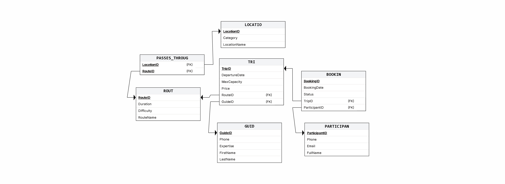

# פרויקט ניהול נתונים - מערכת תכנון והרשמה למסלולי טיולים (Routes DB)

פרויקט זה נועד להדגים סביבת עבודה מקומית שלמה הכוללת מסד נתונים, כלים לניהול, וייבוא נתונים אוטומטי. המערכת עטופה כולה ב-Docker ומאפשרת טיפול קל, מהיר והדיר של נתונים תוך שימוש בשפת Python להמרת קבצים שונים לטבלאות חיות בבסיס הנתונים.

🔗 **[לפרויקט המקביל ב-Google AI Studio >](https://ai.studio/apps/8030069a-f754-4343-89fe-485e07c80196)**

---

## 🛠️ טכנולוגיות וכלים (Stack)
בפרויקט זה השתמשנו במספר כלים כדי לבנות את הסביבה המושלמת:
*   **PostgreSQL:** ליבת הפרויקט. מסד נתונים רלציוני, אמין ומהיר לשמירת הנתונים.
*   **Docker & Docker-Compose:** לאריזה (Containerization) של מסד הנתונים והממשקים, כך שאין צורך בהתקנות מקומיות ומסורבלות למעט תוכנת Docker.
*   **pgAdmin 4:** ממשק גרפי (Web-based) לניהול בסיס הנתונים. דרכו אנו כותבים שאילתות, מנהלים טבלאות ובודקים נתונים ויזואלית.
*   **Python:** שפת התכנות שמשמשת לקישור הלוגי ועיבוד הנתונים.
    *   `pandas`: לקריאת קבצי נתונים (CSV ו-Excel) ומניפולציה שלהם.
    *   `SQLAlchemy`: ליצירת מנוע החיבור (Engine) בין פייתון ל-Postgres בצורה חלקה.
    *   `psycopg2`: הדרייבר (Driver) שמאפשר לפייתון לדבר "בשפת PostgreSQL".

---

## 📂 סטרוקטורת הפרויקט (Folder Structure)

לאחר הכנת הסביבה, מבנה התיקיות שלכם נראה בערך כך:
```text
routes/
│
├── docker-compose.yml       # קובץ הגדרות הקונטיינרים (Postgres + pgAdmin)
├── .env                     # משתני סביבה סודיים (שמות משתמש, סיסמאות)
├── README.md                # קובץ הסבר זה
├── import_data.py           # סקריפט אוטומטי לייבוא קבצי CSV/Excel לדאטהבייס
│
├── init-db/                 # סקריפטים לריצה ראשונית בזמן הקמת המסד
│   ├── 01_dropTables.sql
│   └── 02_createTables.sql
│
└── dbFiles/                 # תיקייה לאחסון קבצי נתונים חיצוניים וגיבויים
    ├── sample.csv           # קובץ דוגמה (CSV)
    ├── sample.xlsx          # קובץ דוגמה (Excel)
    └── routes_db_backup.dump  # קובץ גיבוי של בסיס הנתונים
```
> הערה: בנוסף לקובץ התרשים המערכתי (`TOUR DIAGRAM fix.erdplus`), צורפו תרשימים ויזואליים הממחישים את הלוגיקה, הממשקים והקשרים בבסיס הנתונים שלנו. 

### תרשים עיצוב המערכת (ERD וסכמות):
*תרשים 1: מודל יישות וקשרים (ERD)*


*תרשים 2: מבנה סכמות המסד*
.png)

---

## 🚀 הוראות הפעלה ושימוש בשלבים

### 1. הרמת בסיס הנתונים (Docker)
כדי להתחיל לעבוד, יש להפעיל את Docker Desktop. לאחר מכן, לפתוח את הטרמינל בתיקיית הפרויקט ולהריץ:
```bash
docker-compose up -d
```
פקודה זו תרים את מערכת הפוסטגרס ואת שרת ה-pgAdmin ברקע.

### 2. ממשק הניהול - pgAdmin
1. פתחו דפדפן והכנסו לכתובת: `http://localhost:8080`
2. **התחברות ראשונית:**
   * User: `admin@example.com`
   * Pass: `admin`
3. **חיבור לשרת ה- Postgres:**
   * קליק ימני על Servers -> Register -> Server.
   * בלשונית Connection למלא: 
     * **Host:** `db`
     * **Database:** `routes_db`
     * **Username:** `admin`
     * **Password:** `admin` 
   * לשמור ולראות את העץ נפתח.

### 3. העלאת נתונים אוטומטית (Python)
כדי לייבא את קבצי ה-CSV וה-Excel (מתוך תיקיית `dbFiles`), הפעילו את הסביבה הווירטואלית והריצו את הסקריפט:
```bash
# הפעלת הסביבה הווירטואלית
.\venv\Scripts\Activate

# הרצת הסקריפט (קורא את קבצי התוכן ויוצר טבלאות באופן אוטומטי)
python import_data.py
```
*הערה: אם זו הפעם הראשונה, יש לוודא שהתקנתם את התלויות בעזרת: `pip install pandas sqlalchemy psycopg2-binary openpyxl python-dotenv`*

### 4. גיבוי ושחזור (Backup & Restore)
**גיבוי המסד באמצעות CMD (בזמן הקונטיינר רץ):**
```cmd
docker exec -t postgres_db pg_dump -U admin -F c routes_db > dbFiles/routes_db_backup.dump
```
**(הקובץ יישמר בתיקיית dbFiles)**

**שחזור מגיבוי (במידת הצורך):**
```cmd
docker exec -i postgres_db pg_restore -U admin -d routes_db -1 < dbFiles/routes_db_backup.dump
```
*(ניתן לבצע פעולות אלו גם ידנית דרך ממשק ה-pgAdmin בקליק ימני על בסיס הנתונים)*

---

הפרויקט בנוי בצורה גמישה ומוכן לשינויים או סקייל עתידי תוך שמירה על עקרונות עבודה נכונים של ניהול נתונים והפרדת סביבות. בהצלחה! 
