# פרויקט ניהול נתונים - מערכת תכנון והרשמה למסלולי טיולים (Routes DB)

הדסה נקי, תהילה כהן
<div dir="rtl">

פרויקט זה מציג סביבת עבודה מקומית ושלמה לניהול עשרות אלפי רשומות של מסלולי טיולים. המערכת ארוזה ב-Docker ומאפשרת ייבוא, ניהול ויצירת נתונים באוטומציה מלאה באמצעות שפת Python, החל מקבצי אקסל ועד הזרקה סינתטית לבדיקות עומסים בשורות.

🔗 **[לפרויקט המקביל ב-Google AI Studio >](https://ai.studio/apps/8030069a-f754-4343-89fe-485e07c80196)**

---

## 🛠️ טכנולוגיות וכלים (Stack)
*   **PostgreSQL:** ליבת הפרויקט. מסד נתונים רלציוני, אמין ומהיר.
*   **Docker & Docker-Compose:** לאריזה (Containerization) של מסד הנתונים והממשקים, ללא צורך בהתקנות מקומיות או הגדרות שרת. 
*   **pgAdmin 4:** ממשק גרפי (Web-based) לניהול הדאטה-בייס ולשאילתות.
*   **Python:** שפת התכנות המשמשת ללוגיקת הכנסת וייצור הנתונים:
   *   `pandas` ו-`openpyxl`: לקריאת קבצי נתונים (CSV ו-Excel) ומניפולציה.
   *   `SQLAlchemy` ו-`psycopg2`: דרייברים ומנועי קישור המאפשרים לפייתון לשוחח ישירות מול Postgres.
   *   `Faker`: ספריה קריטית לייצור נתוני דמה ריאליסטיים בכמויות ענק.

---

## 📂 מבנה התיקיות (Folder Structure)

הפרויקט מחולק בצורה מסודרת:
```text
routes/
├── docker-compose.yml       # קובץ הדלקה למכולות הקונטיינרים (Postgres + pgAdmin)
├── .env                     # משתני סביבה (סיסמה, משתמש - שימו לב למלא לפני הרצה)
├── README.md                # מסמך הסבר זה
├── import_data.py           # סקריפט ייבוא מקבצי CSV/Excel
├── bulk_generate.py         # סקריפט פייתון לבניית ויצירת נתונים מאסיבית באמצעות Faker
├── init-db/                 # שאילתות להרצה ראשונות שרצות כשהדאטה-בייס עולה
│   ├── 01_dropTables.sql
│   ├── 02_createTables.sql
│   └── 03_insertTables.sql  # הזרקת נתונים ראשונית דרך קוד SQL
└── dbFiles/                 # תיקייה לקבצי הנתונים הישנים והגיבויים
    ├── sample.csv           # קובץ משתתפים (CSV)
    ├── sample.xlsx          # קובץ הזמנות (Excel)
    └── routes_db_backup.dump  # Dump מאסיבי של הדאטא-בייס לגיבוי
```

## תרשימים    

*תרשים 1: תרשים ישויות קשרים (DSD)*  


*תרשים 2: תרשים מבנה נתונים (ERD)*  
.png)

*הערה: בקובצי הפרויקט נמצאים מספר תרשימי ERD להבנת מערך הטבלאות (כגון `TOUR DIAGRAM fix.erdplus`).*

---

## סקריפטים של SQL 

להלן הקישורים לקבצי ה-SQL המשמשים להקמת המערכת:

* [יצירת טבלאות (Create Tables)](./Phase%201/scripts/02_createTables.sql) – סקריפט ליצירת המבנה של בסיס הנתונים.
* [מחיקת טבלאות (Drop Tables)](./Phase%201/scripts/01_dropTables.sql) – סקריפט למחיקת כל הטבלאות הקיימות.
* [הכנסת נתונים (Insert Data)](./Phase%201/scripts/03_insertTables.sql) – סקריפט המכיל נתונים ראשוניים.

---

## 💉 דרכי הזרקת הנתונים למערכת

יישמנו **3 שיטות שונות** למילוי מסד הנתונים, המדגימות הבנה עמוקה של טיפול במידע במערכות מתקדמות עכשוויות:

### 1. הכנסת נתונים משאילתות SQL מוכנות
שימוש בסיסי ומסורתי - נתונים המיוצרים מראש כשורות של פקודות `INSERT`.
*   **איך זה עובד אצלנו?** בקובץ `init-db/03_insertTables.sql` קיימות פקודות מוכנות שמזריקות למסד נתוני בסיס סטטיים. הקובץ רץ אוטומטית ברגע שה-Docker מורם לאוויר.

### 2. ייבוא נתונים מקבצים חיצוניים קיימים (CSV & Excel)
הכנסת נתונים ארגוניים שנשמרו בפורמטים סטנדרטיים והמרתם לטבלאות רלציוניות אמיתיות ללא רגרסיה.
*   **איך זה עובד אצלנו?** בעזרת הסקריפט `import_data.py`. הסקריפט קורא צמד קבצים המדמים מידע היסטורי ארגוני (מתוך תיקיית `dbFiles`), מעבד אותם ודוחף אותם תחת עמודות נכונות ישירות לטבלאות `PARTICIPANT` ו-`BOOKING` בעזרת ספריית `pandas` וקישור `SQLAlchemy`.

### 3. ייצור המוני של נתונים חסרי תקדים (Faker Generator)
יצירת נתונים סינתטיים לבדיקות ביצועים ולמידה של מאסות נתונים.
*   **איך זה עובד אצלנו?** הסקריפט הנפרד `bulk_generate.py` משתמש במחולל `Faker`. במקום לייבא קבצים ידנית, הוא מגריל מאות שמות, טלפונים נוכחיים, תאריכים ומחירים, ומזריק אותם בבת אחת למערכת הפוסטגרס.
הסקריפט בורא מאות מדריכים חדשים, ומעל ל- **20,000 רשומות רנדומליות** של משתתפים והזמנות.

#### הצגת הנתונים בטבלאות ממערכת pgAdmin
**טבלת משתתפים (Participant) - מעל 20,000 רשומות**  
  


**טבלת טיולים (Trip)**  


---

## 🚀 הוראות שימוש והפעלה בשלבים מפורטים

### שלב 1: הקמת הסביבה ו- Docker
1. פתחו את פרויקט ה-VS Code.
2. ודאו שתוכנת **Docker** דולקת במחשבכם (Docker Desktop מעידה על ירוק).
3. פתחו טרמינל והריצו:
   ```bash
   docker-compose up -d
   ```

### שלב 2: כניסה לפאנל הניהול - pgAdmin והתחברות לשרת
1. באותו הזמן, כנסו בדפדפן האישי שלכם לכתובת: `http://localhost:8080`.
2. התחברו למערכת עם פרטי החשבון הללו:
   * **אימייל:** `admin@example.com`
   * **סיסמא:** `admin`
3. באפליקציה בבר השמאלי, קליק ימני על `Servers` -> ואז `Register` -> `Server...`
4. בחלונית בחוצץ **Connection**, הזינו בדיוק:
   * **Host:** `db`
   * **Username:** `admin`
   * **Password:** `admin`
   * לחצו Save לבניית הסרבר. תראו את עץ הספריות תחת `Schemas` -> `public` -> `Tables`.

### שלב 3: מילוי המידע בסקריפטים השונים (בסביבת Python)
**הפעלת הסביבה הווירטואלית ויישום ספריות חובה:**
```bash
.\venv\Scripts\Activate
pip install pandas sqlalchemy psycopg2-binary openpyxl python-dotenv faker
```

**להכנסת נתונים מהירה מתוך קובץ פיזי והיסטורי (CSV/Excel):**
```bash
python import_data.py
```

**להזרקת ענק של הנתונים החיים - באמצעות מחולל פייתון (עשרות אלפי שורות!):**
```bash
python bulk_generate.py
```
> הערה: הפעולה ב-bulk תיקח כמה רגעים בגלל כמות השורות הנבנות אל מול מסד הנתונים בבת אחת. 

---

## 💾 גיבוי עכשווי (Backup & Restore)
למקרה ותרצו להעביר למחשב אחר או המערכת קורסת, דאגנו לבנות פקודות בשביל לצלם ולשמור את מצב האתר וכל אלפי השורות בקובץ `.dump`. הקובץ הבא הועתק תחת נתיב התיקיות (`dbFiles`):

**ליצירת גיבוי עדכני חדש מהמערכת (דרך CMD):**
```cmd
docker exec -t postgres_db pg_dump -U admin -F c routes_db > dbFiles/routes_db_backup.dump
```
  


**לשחזור נתונים מקובץ בחזרה אל תוך המערכת:**
```cmd
docker exec -i postgres_db pg_restore -U admin -d routes_db -1 < dbFiles/routes_db_backup.dump
```


---

## 📊 דוח הפרויקט שלב ב - שאילתות ואילוצים
הדוח מסכם את השאילתות, העדכונים, האילוצים והאינדקסים שנוצרו עבור השלב השני של הפרויקט.

### חלק א': 4 שאילתות בכתיבה כפולה והשוואת יעילות

**שאילתה 1: מציאת משתתפים במסלולים הסטוריים או טבעיים**  
**תיאור:** שליפת שמות טלפונים של משתתפים שהזמינו סיור העובר באתר מסוג 'Historic' או 'Nature'.
*   **קוד הדרך הראשונה (IN):**
```sql
SELECT FullName, Phone FROM PARTICIPANT WHERE ParticipantID IN (SELECT ParticipantID FROM BOOKING WHERE TripID IN (SELECT TripID FROM TRIP WHERE RouteID IN (SELECT RouteID FROM PASSES_THROUGH WHERE LocationID IN (SELECT LocationID FROM LOCATION WHERE Category IN ('Historic', 'Nature')))));
```
*   **קוד הדרך השנייה (EXISTS / JOIN):**
```sql
SELECT p.FullName, p.Phone FROM PARTICIPANT p WHERE EXISTS (SELECT 1 FROM BOOKING b JOIN TRIP t ON b.TripID = t.TripID JOIN PASSES_THROUGH pt ON t.RouteID = pt.RouteID JOIN LOCATION l ON pt.LocationID = l.LocationID WHERE b.ParticipantID = p.ParticipantID AND l.Category IN ('Historic', 'Nature'));
```
**תוצאת השאילתה מתוך הטבלאות האמיתיות:**

| FullName | Phone |
|----------|-------|
| Avraham Israel | 050-1111111 |
| Moshe Levi     | 052-2222222 |
| Rachel Cohen   | 054-3333333 |

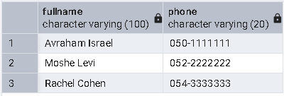

**הסבר הבדל ויעילות:** שימוש ב- EXISTS לרוב יהיה יעיל יותר מאחר והוא עוצר בעת מציאת ההתאמה הראשונה לתנאי (Short-circuiting) ולא בונה מבנה נתונים מלא לכל תתי-השאילתות כמו ב- IN, במיוחד כשהטבלאות גדלות.

**שאילתה 2: סיורים פעילים בשנה**  
**תיאור:** מציאת שמות מסלולים שיש להם יציאות (לפחות הפעלה אחת) בשנת 2026.
*   **קוד הדרך הראשונה (GROUP BY):**
```sql
SELECT r.RouteName, COUNT(t.TripID) AS TotalTrips FROM ROUTE r JOIN TRIP t ON r.RouteID = t.RouteID WHERE EXTRACT(YEAR FROM t.DepartureDate) = 2026 GROUP BY r.RouteID, r.RouteName HAVING COUNT(t.TripID) > 0;
```
*   **קוד הדרך השנייה (Inline Query):**
```sql
SELECT RouteName, TotalTrips FROM (SELECT r.RouteName, (SELECT COUNT(*) FROM TRIP t WHERE t.RouteID = r.RouteID AND EXTRACT(YEAR FROM t.DepartureDate) = 2026) AS TotalTrips FROM ROUTE r) AS Temp WHERE TotalTrips > 0;
```
**תוצאת השאילתה מתוך הטבלאות האמיתיות:**

| RouteName | TotalTrips |
|-----------|------------|
| Negev Night Trail | 1 |
| Jerusalem Old City | 1 |
| Golan Heights Trek | 1 |

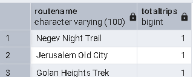  
**הסבר הבדל ויעילות:** שימוש ב- GROUP BY יחד עם JOIN ממוטב על ידי מנועי ה-SQL והוא יעיל בהרבה מתת-שאילתה מתואמת שמתבצעת על כל שורה ושורה.

**שאילתה 3: מדריכים פנויים במאי 2026**  
**תיאור:** שמות מדריכים שלא שובצו לאף טיול ב- 5/2026.
*   **קוד הדרך הראשונה (NOT IN):**
```sql
SELECT FirstName, LastName FROM GUIDE WHERE GuideID NOT IN (SELECT GuideID FROM TRIP WHERE EXTRACT(YEAR FROM DepartureDate) = 2026 AND EXTRACT(MONTH FROM DepartureDate) = 5);
```
*   **קוד הדרך השנייה (LEFT JOIN):**
```sql
SELECT g.FirstName, g.LastName FROM GUIDE g LEFT JOIN TRIP t ON g.GuideID = t.GuideID AND EXTRACT(YEAR FROM t.DepartureDate) = 2026 AND EXTRACT(MONTH FROM t.DepartureDate) = 5 WHERE t.TripID IS NULL;
```
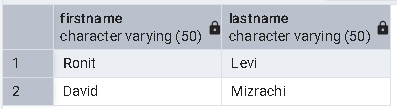  
**הסבר הבדל ויעילות:** שימוש ב- LEFT JOIN עוקף פעמים רבות כשלים המתרחשים באופרטור NOT IN כשיש ערכי NULL במערכת.

**שאילתה 4: מחירי מקסימום לקטגוריה**  
**תיאור:** הטיול שהיה הכי יקר לכל דרגת קושי.
*   **קוד הדרך הראשונה (Subquery MAX):**
```sql
SELECT t.TripID, r.Difficulty, t.Price FROM TRIP t JOIN ROUTE r ON t.RouteID = r.RouteID WHERE t.Price = (SELECT MAX(t2.Price) FROM TRIP t2 JOIN ROUTE r2 ON t2.RouteID = r2.RouteID WHERE r2.Difficulty = r.Difficulty);
```
*   **קוד הדרך השנייה (Window Function):**
```sql
SELECT TripID, Difficulty, Price FROM (SELECT t.TripID, r.Difficulty, t.Price, RANK() OVER (PARTITION BY r.Difficulty ORDER BY t.Price DESC) AS rnk FROM TRIP t JOIN ROUTE r ON t.RouteID = r.RouteID) AS ranked WHERE rnk = 1;
```
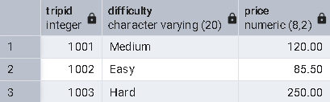  
**הסבר הבדל ויעילות:** פונקציות חלון (Window function) מדרגות במעבר יחיד על הנתונים ללא סריקה מיותרת חוזרת של המסד.

---

### חלק ב': 4 שאילתות SELECT נוספות

**שאילתה 5: הכנסות למדריך**  
**תיאור:** מציאת סך ההכנסות שיוצרו מהזמנות ששולמו או אושרו (Paid/Confirmed) פר מדריך בשנת 2026, ימויין מהגבוה לנמוך.
```sql
SELECT g.FirstName || ' ' || g.LastName AS GuideName, SUM(t.Price) AS TotalRevenue FROM GUIDE g JOIN TRIP t ON g.GuideID = t.GuideID JOIN BOOKING b ON b.TripID = t.TripID WHERE b.Status IN ('Paid', 'Confirmed') AND EXTRACT(YEAR FROM t.DepartureDate) = 2026 GROUP BY g.GuideID, g.FirstName, g.LastName ORDER BY TotalRevenue DESC;
```
**תוצאת השאילתה מתוך הטבלאות האמיתיות:**

| GuideName | TotalRevenue |
|-----------|--------------|
| David Mizrachi | 250.00 |
| Yossi Cohen | 120.00 |

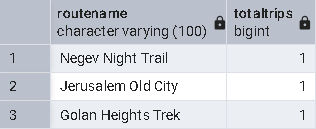

**שאילתה 6: פרטי משתתפי אקסטרים**  
**תיאור:** פרטי קשר למשתמשים שהזמינו מסלול קשה הכולל מיקומים (לפחות מעבר אחד). מספק את השם והדואל.
```sql
SELECT p.FullName, p.Email, p.Phone FROM PARTICIPANT p JOIN BOOKING b ON p.ParticipantID = b.ParticipantID JOIN TRIP t ON b.TripID = t.TripID JOIN ROUTE r ON t.RouteID = r.RouteID WHERE r.Difficulty = 'Hard' AND r.RouteID IN (SELECT RouteID FROM PASSES_THROUGH GROUP BY RouteID HAVING COUNT(LocationID) > 0);
```
**תוצאת השאילתה מתוך הטבלאות האמיתיות:**

| FullName | Email | Phone |
|----------|-------|-------|
| Rachel Cohen | rachel@gmail.com | 054-3333333 |

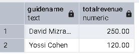

**שאילתה 7: מחקר עונתי**  
**תיאור:** איתור החודש בו בוצעו יצירות ההזמנה (Booking) הרבות ביותר (החודש הנמכר ביותר).
```sql
SELECT EXTRACT(MONTH FROM BookingDate) AS BookingMonth, COUNT(BookingID) AS TotalBookings FROM BOOKING WHERE EXTRACT(YEAR FROM BookingDate) = 2026 GROUP BY EXTRACT(MONTH FROM BookingDate) ORDER BY TotalBookings DESC LIMIT 1;
```
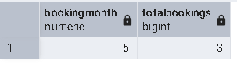

**שאילתה 8: מסלולים גדולים מהממוצע**  
**תיאור:** החזרת טיולים בהם מספר המקומות הכולל גדול מהממוצע, כולל שם המדריך מחובר.
```sql
SELECT t.TripID, r.RouteName, (g.FirstName || ' ' || g.LastName) AS GuideName, t.DepartureDate, t.MaxCapacity FROM TRIP t JOIN ROUTE r ON t.RouteID = r.RouteID JOIN GUIDE g ON t.GuideID = g.GuideID WHERE t.MaxCapacity > (SELECT AVG(MaxCapacity) FROM TRIP) ORDER BY t.DepartureDate;
```
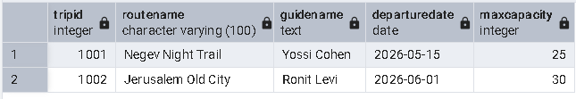

---

### חלק ג': שאילתות Update


1. **עליית מחיר לטבע-קשה:** העלאת המחיר ב-10% עבור כל טיול שעובר באתר מסוג 'Nature' ודרגת הקושי של המסלול שלו היא 'Hard'.
```sql
UPDATE TRIP SET Price = Price * 1.10 WHERE RouteID IN (SELECT r.RouteID FROM ROUTE r JOIN PASSES_THROUGH pt ON r.RouteID = pt.RouteID JOIN LOCATION l ON pt.LocationID = l.LocationID WHERE r.Difficulty = 'Hard' AND l.Category = 'Nature');
`
**לפני עדכון מחיר:**  
  
**אחרי עדכון מחיר:**  
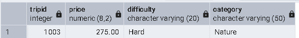``
2. **ביטול הזמנות אוטומטי:** קביעת סטטוס 'Cancelled' לכל הזמנה אשר לא שולמה והתבצעה לחודש הנוכחי.
```sql
UPDATE BOOKING SET Status = 'Cancelled' WHERE Status != 'Paid' AND TripID IN (SELECT TripID FROM TRIP WHERE EXTRACT(MONTH FROM DepartureDate) = EXTRACT(MONTH FROM CURRENT_DATE) AND EXTRACT(YEAR FROM DepartureDate) = EXTRACT(YEAR FROM CURRENT_DATE));
`
**לפני ביטול ההזמנות:**  
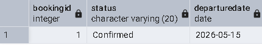  
**אחרי השלמת הביטול:**  
``
3. **קידום מדריכים:** שרשור הקידומת 'Senior' לתחום המומחיות של המדריך, במידה והעביר יותר מ- 5 סיורים במערכת.
```sql
UPDATE GUIDE SET Expertise = 'Senior ' || Expertise WHERE GuideID IN (SELECT GuideID FROM TRIP GROUP BY GuideID HAVING COUNT(TripID) > 5) AND Expertise NOT LIKE 'Senior %';
`
**לפני קידום מדריכים:**  
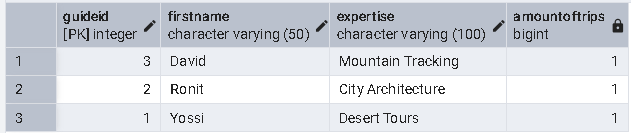  
**אחרי קידום המדריכים:**  
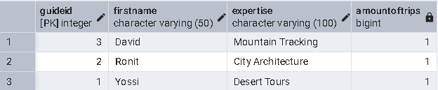``

---

### חלק ד': שאילתות Delete


1. **פינוי מקומות דדליין:** מחיקת רישומים שממתינים ללא תשלום עבור סיור שאמור לצאת תוך כ-3 ימים.
```sql
DELETE FROM BOOKING WHERE Status = 'Pending' AND TripID IN (SELECT TripID FROM TRIP WHERE DepartureDate <= CURRENT_DATE + INTERVAL '3 days');
`
**לפני מחיקת הזמנות ממתינות:**  
  
**אחרי המחיקה:**  
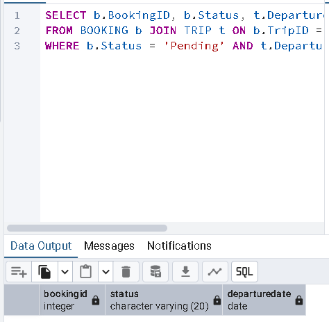``
2. **מחיקת מיקומים מיותמים:** מחיקת תחנות שלא עברו באף תצורת מסלול.
```sql
DELETE FROM LOCATION WHERE LocationID NOT IN (SELECT LocationID FROM PASSES_THROUGH);
`
**לפני מחיקת מיקומים:**  
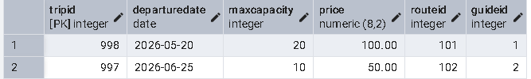  
**אחרי המחיקה:**  
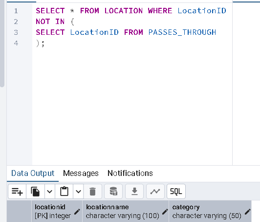``
3. **צמצום מסד - ניקוי טיולים ריקים:** מחיקת כל טיולי העבר אשר יצאו לפועל ללא בני אדם.
```sql
DELETE FROM TRIP WHERE TripID NOT IN (SELECT TripID FROM BOOKING);
```

---

### חלק ה': אילוצים (Constraints)
הוטמעו אילוצים קריטיים במסד הנתונים שחוסמים הכנסת נתונים שגויים כמוראה בצילומי המסך:

1. **תקינות תמחור וכמות:** הגבלות על קליטת מספרים שליליים להגנה על תמחור. (`CHECK (Price >= 0)`)
```sql
INSERT INTO TRIP (TripID, DepartureDate, MaxCapacity, Price, RouteID, GuideID) VALUES (901, '2026-06-01', 20, -50, 101, 1);
`
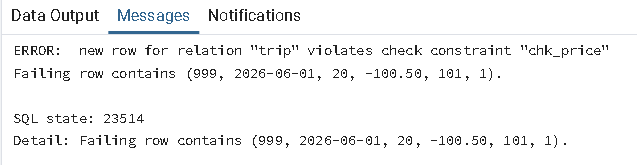``
2. **הגבלת על סטטוסים:** חובה להכניס לסטטוס הזמנה רק: 'Paid', 'Pending', 'Cancelled'.
```sql
INSERT INTO BOOKING (BookingID, BookingDate, Status, TripID, ParticipantID) VALUES (901, '2026-05-19', 'UnknownStatus', 1001, 1);
`
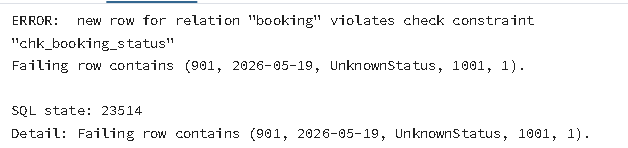``
3. **הגבלת רמות קושי בטבלת מסלולים:** ערכים קבועים של 'Easy', 'Medium', 'Hard'.
```sql
INSERT INTO ROUTE (RouteID, RouteName, Duration, Difficulty) VALUES (901, 'Bad Route', 100, 'Extreme');
`
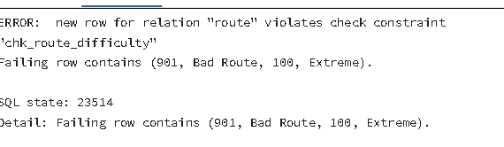``

---

### חלק ו': הדגמות Rollback ו- Commit
טרנזקציה המאפשרת לנו לערוך שינוי הרסני (הקפצת כל המחירים פי 2!) ולבחון אותו לפני שנמנע את החלתו לצמיתות. להמחשה בדוח, הריצו הכל ברצף ועקבו אחר הלוגים:
```sql
SELECT Price FROM TRIP WHERE TripID = 1001; -- הצגת מחיר התחלתי
`

`sql

BEGIN;
UPDATE TRIP SET Price = Price * 2;
SELECT Price FROM TRIP WHERE TripID = 1001; -- מחיר לאחר עלייה (עדיין בזיכרון, טרם ביטול)
`

`sql

ROLLBACK;
SELECT Price FROM TRIP WHERE TripID = 1001; -- מחיר שהוחזר לקדמותו לחלוטין
`

```

---

### חלק ז': אינדקסים (Indexes)
כדי להפיק ולהציג את ההבדלים בזמני הריצה לפני ואחרי יצירת אינדקס (Seq Scan לעומת Index Scan), נריץ:

**שלב 1: סריקה איטית ללא אינדקס (Seq Scan):**
```sql
EXPLAIN ANALYZE SELECT * FROM TRIP WHERE DepartureDate = '2026-05-15';
```
*(לאחר הרצה תופיע השורה `Seq Scan on trip`)*

**שלב 2: הוספת שלושה אינדקסים לזרוז שאילתות:**
1. `idx_trip_departure`: הושם על תאריכי יציאה של סיורים - לשליפה מהירה למערכת של טווח תאריך מבוקש.
2. `idx_booking_trip`: על מזהי הטיולים בטבלת ההזמנות, נועד לחיזוק השאילתות מסוג JOIN שניתקלנו למציאת מוזמנים לפי פרטי טיול.
3. `idx_participant_email`: על הדוא"ל בטבלת המשתתפים, נועד למסכי הזדהות לקוחות (אלמנט כניסה נפוץ ברשת).
```sql
CREATE INDEX idx_trip_departure ON TRIP(DepartureDate);
CREATE INDEX idx_booking_trip ON BOOKING(TripID);
CREATE INDEX idx_participant_email ON PARTICIPANT(Email);
```

**שלב 3: סריקה מהירה עם אינדקס (Index Scan):**
```sql
EXPLAIN ANALYZE SELECT * FROM TRIP WHERE DepartureDate = '2026-05-15';
```
*(כעת יופיע בפלט `Index Scan using idx_trip_departure` - וזמן הריצה יתקצר!)*

**הסבר תוצאות זמני הריצה:** בעת הפעלת טבלת `EXPLAIN ANALYZE` המערכת תחילה מחשבת במחיר יקר באמצעות `Seq Scan`. אחרי בניית האינדקס, אנו מקבלים חיתוך אדיר בעלות (Cost) עם אינדיקצייה לביצוע של `Index Scan`.

</div>