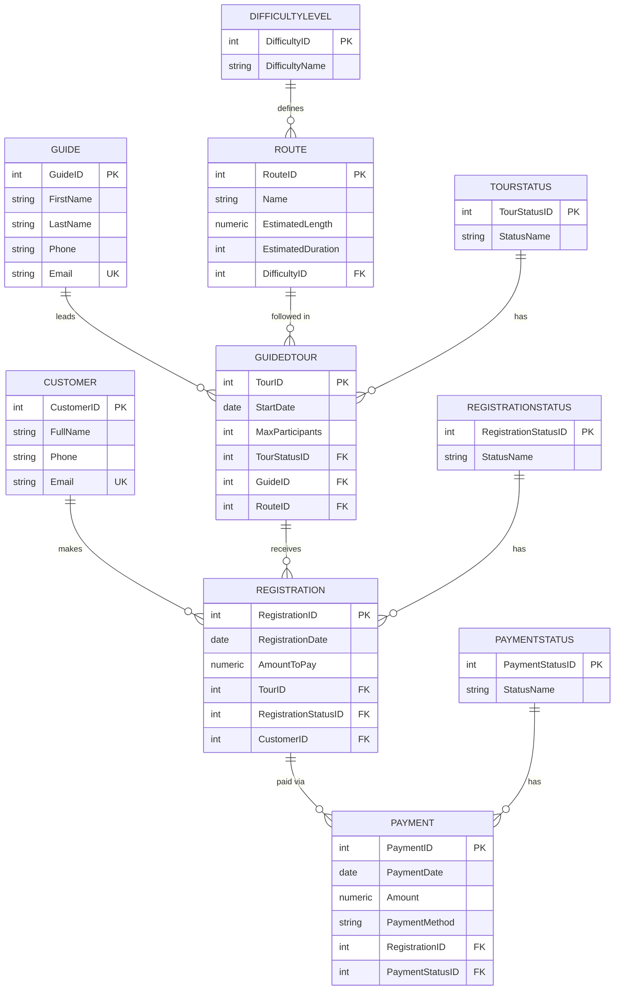
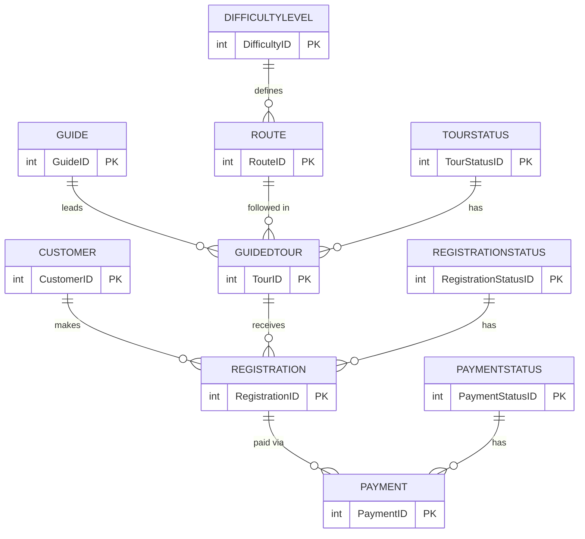
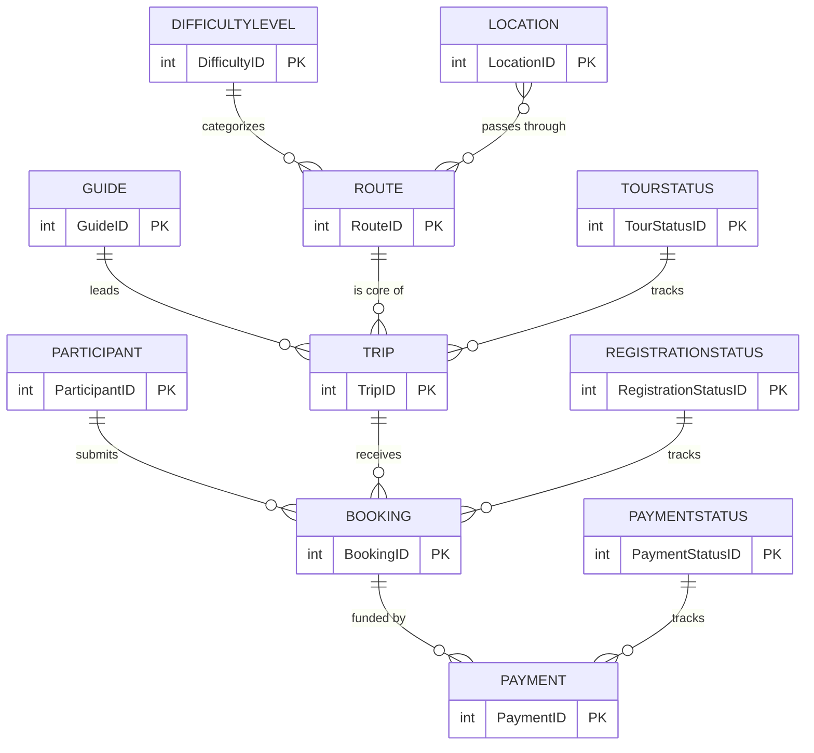
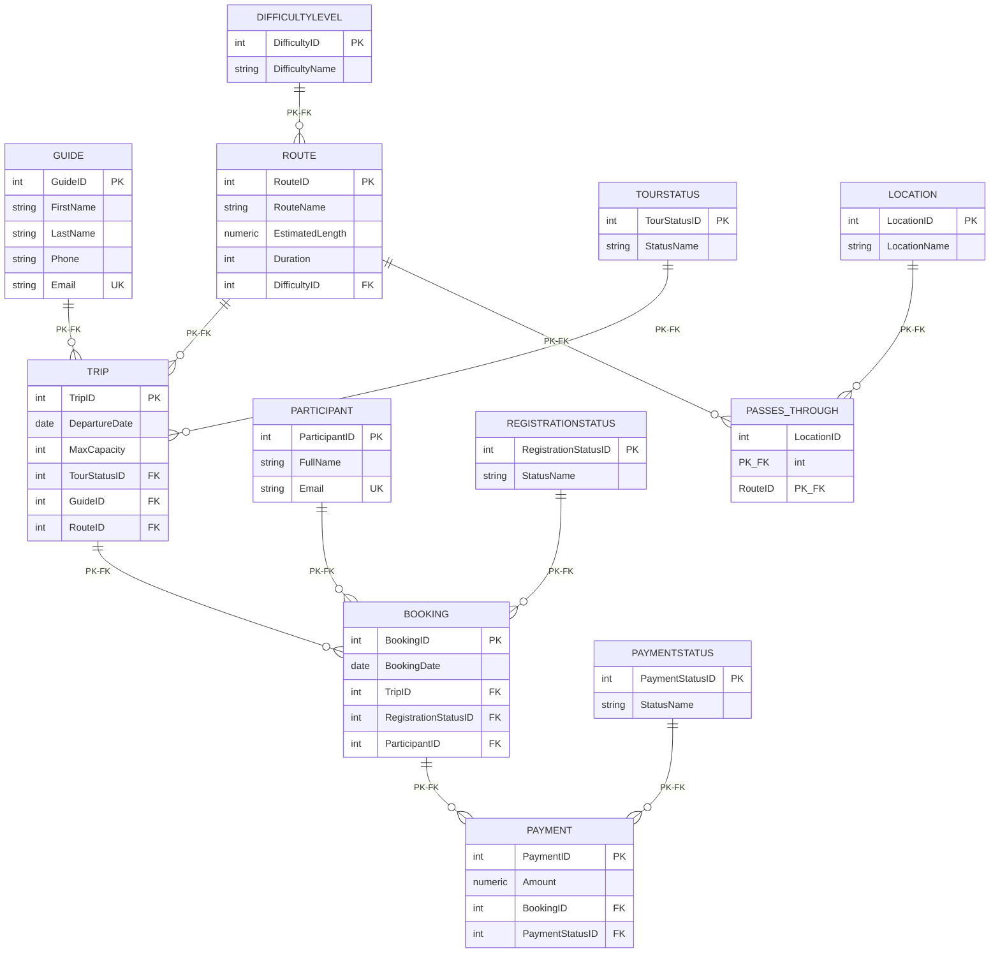

# דוח פרויקט - שלב ג' (אינטגרציה)

## 1. אלגוריתם הינדוס לאחור (Reverse Engineering)
תהליך ההינדוס לאחור מאפשר לנו לעבור מסכמת בסיס נתונים (טבלאות קיימות, קשרי גומלין - DSD) בחזרה למודל הישויות והקשרים (ERD). 
**שלבי האלגוריתם:**
1. **זיהוי ישויות חזקות:** מעבר על כל הטבלאות שאין להן מפתחות זרים (Foreign Keys) או שמפתח הראשי שלהן אינו מורכב ממפתחות זרים. טבלאות אלו מסומנות בישויות רגילות ב-ERD. (לדוגמה: `GUIDE`, `CUSTOMER`, `DIFFICULTYLEVEL`, `TOURSTATUS`, `REGISTRATIONSTATUS`, `PAYMENTSTATUS`).
2. **זיהוי מאפיינים ומפתחות ראשיים:** עבור כל ישות חזקה שזוהתה, כל העמודות בטבלה הופכות למאפיינים (Attributes) של הישות, כאשר עמודת ה-Primary Key מסומנת כמאפיין מפתח (קו תחתון).
3. **זיהוי ישויות חלשות ותלויות:** איתור טבלאות שהמפתח הראשי שלהן מורכב כולו או בחלקו ממפתח זר לטבלה אחרת, דבר המעיד על ישות חלשה (אין כאן בטבלאות שקיבלנו).
4. **זיהוי קשרים (Relationships) מסוג 1:N:** איתור טבלאות המכילות מפתח זר המפנה לטבלה אחרת (חזקה). מפתח זר זה מתורגם לקשר בין הישות הנוכחית לישות המופנית. הישות שמכילה את המפתח הזר ממוקמת בצד ה-N, והישות המוצבעת בצד ה-1.
   * לדוגמה: טבלת `ROUTE` מכילה FK ל-`DIFFICULTYLEVEL`. זה מתורגם לקשר "שייך לרמה" מסוג N:1.
   * טבלת `REGISTRATION` מכילה FK ל-`CUSTOMER` ול-`GUIDEDTOUR`.
5. **זיהוי קשרים מסוג M:N:** איתור טבלאות המכילות רק מפתחות זרים (ופוטנציאל למאפיינים תיאוריים) שהמפתח הראשי שלהן מורכב משני המפתחות הזרים. טבלאות אלו מתורגמות לקשר M:N ב-ERD, ללא צורך בישות נפרדת אלא רק מעוין קשר. (במערכת שקיבלנו אין קשר M:N טהור ללא משמעות נפרדת).
6. **ציור וארגון המודל:** מיקום הישויות שזוהו בתרשים, מתיחת קווים למעויני הקשר שזוהו בסעיפים 4-5, והוספת מאפייני הישויות לאליפסות מתאימות.

## 2. החלטות עיצוב לשלב האינטגרציה
בסיום תהליך ההינדוס לאחור קיבלנו שני מודלי ERD (שלנו ושל האגף השני). לצורך איחוד, קיבלנו את ההחלטות הבאות (מתועדות לקראת יצירת ה-ERD המשולב):
* **ישות מסלול (`ROUTE`):** נאחד את השדות. נשאיר את השם שלנו (`RouteName`) ואת משך הזמן שלנו (`Duration`), ונוסיף את השדות הייחודיים מהמערכת השנייה: אורך משוער (`EstimatedLength`), ותיאור (`Description`). את רמת הקושי המילולית שלנו (`Difficulty`) נמיר לטבלת ייחוס של רמות קושי (`DIFFICULTYLEVEL`) על ידי FK כפי שעשו במערכת השנייה.
* **ישות מדריך (`GUIDE`):** טבלת המדריכים שלנו תורחב ותכיל את השדות הנוספים של המערכת השנייה (דוא"ל, תאריך לידה, תאריך הצטרפות, תעריף יומי, שנות ניסיון, דירוג, כתובת והערות).
* **ישות לקוח (`PARTICIPANT` מול `CUSTOMER`):** מדובר באותה ישות של לקוח משתתף. נישאר עם שם הטבלה שלנו `PARTICIPANT` (שתייצג לקוחות רשומים) אך נוסיף לה את שדה תאריך ההצטרפות (`JoinDate`) של המערכת השנייה.
* **ישות סיור (`TRIP` מול `GUIDEDTOUR`):** הטבלה שלנו מנהלת מופעי סיורים ספציפיים. נוסיף אליה את השדות מהמערכת השנייה: תאריך סיום (`EndDate`), שעת התחלה וסיום (`StartTime`, `EndTime`), נקודת מפגש (`MeetingPoint`), הערות (`Notes`), ומפתח זר לסטטוס סיור (`TourStatusID`).
* **ישות רישום (`BOOKING` מול `REGISTRATION`):** זוהי טבלת הרישום המקשרת בין משתתף לסיור. נשאיר את טבלת `BOOKING` שלנו, אך נוסיף לה סכום לתשלום (`AmountToPay`), הערות (`Notes`), ומפתח זר לטבלת סטטוסי רישום (`RegistrationStatusID`) מהמערכת השנייה (את השדה המקורי שלנו `Status` נאמץ להשתמש בסטטוס מנורמל בטבלת עזר).
* **הוספת מערך התשלומים:** נאמץ את ישויות `PAYMENT` ו-`PAYMENTSTATUS` מהמערכת השנייה באופן מלא, כאשר טבלת `PAYMENT` תקשר לטבלת `BOOKING` (במקום ל-Registration בגרסה שלהם).

## 3. תרשימי DSD ו-ERD

### DSD מערכת האגף החדש (מתוך הינדוס לאחור)



### ERD מערכת האגף החדש



### ERD משולב (לאחר אינטגרציה)



### DSD משולב (לאחר אינטגרציה)



---

## 4. הסבר מילולי של תהליך האינטגרציה והפקודות (Integrate.sql)

תהליך האינטגרציה בוצע **ללא מחיקת טבלאות קיימות**, תוך שימוש אך ורק בפקודות `ALTER TABLE`, `CREATE TABLE`, ו-`UPDATE` לשינוי הסכמה הקיימת:

1. **ישות `DIFFICULTYLEVEL` (חדשה):** נוצרה טבלת עזר חדשה עם ערכים Easy/Medium/Hard/Extreme. עמודת `Difficulty` הטקסטואלית בטבלת `ROUTE` הוחלפה ב-FK (`DifficultyID`) לאחר מיגרציית הנתונים בעזרת `UPDATE ... WHERE Difficulty = '...'`.

2. **ישות `GUIDE` (הרחבה):** נוספו 8 עמודות חדשות (Email, BirthDate, JoinDate, DailyRate, ExperienceYears, Rating, Address, Notes) תוך שמירת כל הנתונים הקיימים.

3. **ישות `TOURSTATUS` (חדשה) + הרחבת `TRIP`:** נוצרה טבלת סטטוס סיור עם 6 ערכים. טבלת `TRIP` הורחבה עם EndDate, StartTime, EndTime, MeetingPoint, Notes, ו-TourStatusID (FK).

4. **ישות `PARTICIPANT` (הרחבה):** נוספה עמודת `JoinDate`.

5. **ישות `REGISTRATIONSTATUS` (חדשה) + שינוי `BOOKING`:** עמודת `Status` הטקסטואלית ב-`BOOKING` הוחלפה ב-FK (`RegistrationStatusID`) לאחר מיגרציית הנתונים. נוספו גם AmountToPay ו-Notes.

6. **ישויות `PAYMENTSTATUS` ו-`PAYMENT` (חדשות):** נוצר מודול תשלומים מלא, כאשר `PAYMENT` מקושר ל-`BOOKING` (ולא ל-`REGISTRATION` כפי שהיה במקור).

---

## 5. מבטים ושאילתות (Views & Queries)

### מבט 1: V_UpcomingTripsDetails — נקודת מבט האגף המקורי

**תיאור:** מבט המציג פרטי סיורים עתידיים בלבד, כולל שם המסלול, רמת הקושי, שם המדריך ומספר המשתתפים המרבי. משלב 4 טבלאות: `TRIP`, `ROUTE`, `DIFFICULTYLEVEL`, `GUIDE`.

**SELECT \* מהמבט (עד 10 רשומות):**

```
 tripid | departuredate |     routename      | difficultylevel |   guidename    | guidephone  | price  | maxcapacity
--------+---------------+--------------------+-----------------+----------------+-------------+--------+-------------
   1002 | 2026-06-01    | Jerusalem Old City | Easy            | Ronit Levi     | 054-7654321 |  85.50 |          30
   1003 | 2026-06-20    | Golan Heights Trek | Hard            | David Mizrachi | 052-9876543 | 275.00 |          15
```

**שאילתה 1.1 — סיורים עתידיים לקבוצות קטנות (קיבולת < 30):**

תיאור: הצגת סיורים מתוכננים המיועדים לקבוצות קטנות — שימושי לתכנון לוגיסטי.

```sql
SELECT * FROM V_UpcomingTripsDetails
WHERE MaxCapacity < 30
ORDER BY DepartureDate ASC;
```

פלט:
```
 tripid | departuredate |     routename      | difficultylevel |   guidename    | guidephone  | price  | maxcapacity
--------+---------------+--------------------+-----------------+----------------+-------------+--------+-------------
   1003 | 2026-06-20    | Golan Heights Trek | Hard            | David Mizrachi | 052-9876543 | 275.00 |          15
(1 row)
```

**שאילתה 1.2 — מחיר ממוצע לפי רמת קושי:**

תיאור: ניתוח עלות הסיורים העתידיים לפי קטגוריית קושי — שימושי לתמחור ושיווק.

```sql
SELECT DifficultyLevel, AVG(Price) AS AvgTripPrice
FROM V_UpcomingTripsDetails
GROUP BY DifficultyLevel
ORDER BY AvgTripPrice DESC;
```

פלט:
```
 difficultylevel |     avgtripprice
-----------------+----------------------
 Hard            | 275.0000000000000000
 Easy            |  85.5000000000000000
(2 rows)
```

---

### מבט 2: V_CustomerPaymentLedger — נקודת מבט האגף החדש (פיננסי)

**תיאור:** מבט פיננסי המציג לכל הזמנה את פרטי הלקוח, הסכום לתשלום, הסכום ששולם בפועל וסטטוס ההזמנה. משלב `BOOKING`, `PARTICIPANT`, `REGISTRATIONSTATUS` ו-`PAYMENT` (LEFT JOIN לתשלומים).

**SELECT \* מהמבט (עד 10 רשומות):**

```
 bookingid | bookingdate |  customername  |      email       | amounttopay | totalpaid |  bookstatus
-----------+-------------+----------------+------------------+-------------+-----------+--------------
         1 | 2026-05-10  | Avraham Israel | avi@gmail.com    |             |         0 | Cancelled
         2 | 2026-05-11  | Moshe Levi     | moshe@gmail.com  |             |         0 | Needs Action
         3 | 2026-05-12  | Rachel Cohen   | rachel@gmail.com |             |         0 | Confirmed
```

**שאילתה 2.1 — הזמנות עם חוב פתוח:**

תיאור: זיהוי הזמנות שטרם שולמו במלואן — שימושי למשלוח תזכורות תשלום.

```sql
SELECT CustomerName, Email, BookStatus, AmountToPay, TotalPaid,
       (AmountToPay - TotalPaid) AS BalanceDue
FROM V_CustomerPaymentLedger
WHERE TotalPaid < AmountToPay OR TotalPaid IS NULL;
```

פלט:
```
 customername | email | bookstatus | amounttopay | totalpaid | balancedue
--------------+-------+------------+-------------+-----------+------------
(0 rows)
```

**שאילתה 2.2 — סיכום הכנסות לפי סטטוס הזמנה:**

תיאור: סקירה פיננסית מרוכזת — כמה הכנסה צפויה לעומת שהתקבלה בפועל, מחולק לפי סטטוס.

```sql
SELECT BookStatus, SUM(AmountToPay) AS TotalExpected, SUM(TotalPaid) AS TotalReceived
FROM V_CustomerPaymentLedger
GROUP BY BookStatus;
```

פלט:
```
  bookstatus  | totalexpected | totalreceived
--------------+---------------+---------------
 Needs Action |               |             0
 Confirmed    |               |             0
 Cancelled    |               |             0
(3 rows)
```

---

### מבט 3: V_LocationPopularityAndStatus — נקודת מבט משולבת

**תיאור:** מבט רוחבי המשלב מידע מ-`LOCATION`, `PASSES_THROUGH`, `ROUTE`, `TRIP` ו-`TOURSTATUS`. מציג לכל אתר גיאוגרפי את מספר הסיורים המשויכים אליו וסטטוסיהם. מבט זה ייחודי למערכת המשולבת בלבד.

**SELECT \* מהמבט (עד 10 רשומות):**

```
 locationid |  locationname  | category | numberoftripsassociated | currenttourstatuses
------------+----------------+----------+-------------------------+---------------------
          1 | Machtesh Ramon | Nature   |                       1 | Planned
          2 | Western Wall   | Historic |                       1 | Planned
          3 | Banias         | Nature   |                       1 | Planned
```

**שאילתה 3.1 — אתרים ללא סיורים מתוכננים:**

תיאור: איתור נקודות גיאוגרפיות שאינן בשימוש כרגע — שימושי לתכנון מסלולים חדשים.

```sql
SELECT LocationName, Category
FROM V_LocationPopularityAndStatus
WHERE NumberOfTripsAssociated = 0;
```

פלט:
```
 locationname | category
--------------+----------
(0 rows)
```

**שאילתה 3.2 — אתרי טבע מסודרים לפי עומס:**

תיאור: זיהוי אתרי טבע הנפוצים ביותר בסיורים — שימושי לתחזוקה ולניהול עומסים.

```sql
SELECT LocationName, NumberOfTripsAssociated, CurrentTourStatuses
FROM V_LocationPopularityAndStatus
WHERE Category = 'Nature'
ORDER BY NumberOfTripsAssociated DESC;
```

פלט:
```
  locationname  | numberoftripsassociated | currenttourstatuses
----------------+-------------------------+---------------------
 Machtesh Ramon |                       1 | Planned
 Banias         |                       1 | Planned
(2 rows)
```